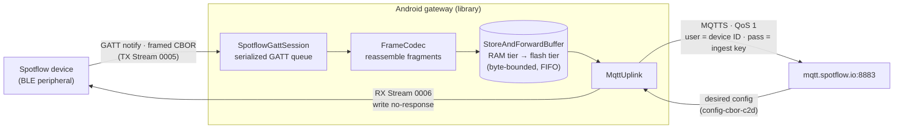
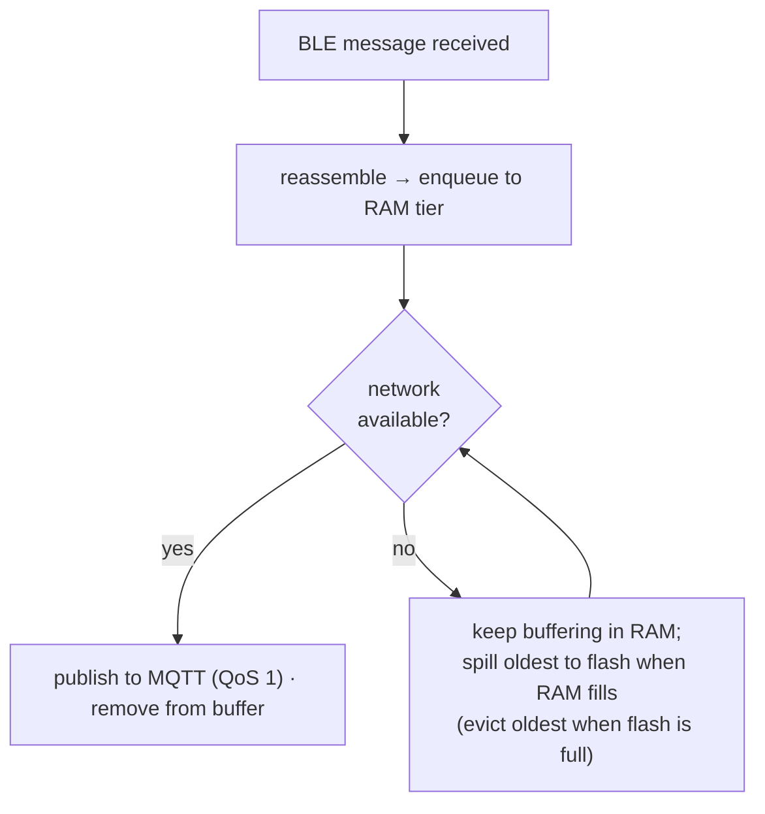

# Spotflow Android BLE Gateway

A reusable Android library (Kotlin, shipped as an AAR) that turns any Android app into a **Spotflow BLE
gateway**: it connects to devices running the [Spotflow Device SDK](https://github.com/spotflow-io/device-sdk)
with the BLE transport enabled and relays their diagnostics (logs, metrics, core dumps, configuration) to
the Spotflow cloud over MQTT — **while the screen is off**, **across reconnects**, and **through network
outages**.

The goal is drop-in integration for hardware vendors who already ship an Android companion app (e.g. a
smart thermostat): add the library, hand it a connection or let it scan, and their BLE devices show up in
Spotflow.

> **Download:** each [GitHub Release](../../releases) (published automatically on every `v*` tag) attaches
> the demo **APK** (sideload to try the gateway) and the library **`.aar`** (drop into an integrating app).

## Modules

| Module | Purpose |
| --- | --- |
| `spotflow-ble-gateway` | The reusable library (`io.spotflow.ble`), published as an AAR. |
| `app` | A reference gateway app that uses the library. |

## How it works



Received BLE messages are reassembled and **buffered RAM-first** (spilling to a flash tier only during
longer outages), then a drainer publishes them to MQTT when the network is available — so data survives
outages, the flash isn't worn in steady state, and BLE ingestion never blocks on the network.

### Protocol

- **GATT** service `26530001-81E5-4861-82AE-2C92E6887922`, characteristics: Capabilities (`0002`),
  Device ID (`0003`), Session Metadata (`0004`), TX Stream `NOTIFY` (`0005`), RX Stream `WRITE`-no-response
  (`0006`).
- **Framing** — a message may exceed the negotiated ATT MTU (as low as 23 bytes), so it is split into
  fragments. `FrameCodec` handles fragmentation (outgoing) and reassembly (incoming). Flags: `IS_FIRST`
  (`0x01`), `IS_LAST` (`0x02`).
- **Message types** — `TELEMETRY` (`0x02`), `REPORTED_CONFIGURATION` (`0x03`),
  `DESIRED_CONFIGURATION` (`0x04`). Telemetry payloads carry logs, metrics **and core-dump chunks**; the
  gateway relays them opaquely (CBOR is not parsed).
- **Cloud** — one MQTT-over-TLS connection per device to `mqtt.spotflow.io:8883`, QoS 1, with MQTT
  `username = device ID` and `password = ingest key`. TLS is validated by the Android system trust store
  (Let's Encrypt ISRG Root X1 — no bundled CA). Telemetry and session metadata publish to `ingest-cbor`,
  reported configuration to `config-cbor-d2c`; desired configuration is received from `config-cbor-c2d`
  and written down the RX Stream.

### Package layout (`spotflow-ble-gateway/src/main/java/io/spotflow/ble`)

- `protocol/` — `GattProfile` (UUIDs), `MessageType`, `Message`, `FrameCodec` (pure JVM, unit-tested).
- `transport/` — `BleConnection` (with `ManagedBleConnection` / `AttachedBleConnection`),
  `SpotflowGattSession` (serialized GATT command queue + callback bridge), `SpotflowScanner`.
- `cloud/` — `MqttUplink`, `MqttConfig` / `SpotflowTopics`, `CredentialsProvider` + `StaticIngestKey`,
  `StoreAndForwardBuffer` (the two-tier RAM+flash buffer) backed by `PersistentMessageQueue` (its SQLite
  flash tier), `MqttAuthException` / `MqttConnectException`.
- `SpotflowGateway`, `GatewaySession` — orchestration.
- `service/SpotflowGatewayService` — foreground service (`connectedDevice`).

## Quick start

### Managed mode (library owns the connection)

```kotlin
val gateway = SpotflowGateway(context, StaticIngestKey("<ingest-key>"))
gateway.startScanning() // scans for the Spotflow service, connects, relays, reconnects
```

### Attach mode (host already owns the connection)

For apps that already hold a `BluetoothGatt` to the same device and don't want a second connection.

```kotlin
val connection = gateway.attach(existingGatt)
```

**Host contract for attach mode:**
1. Forward your `BluetoothGattCallback` events to `connection.gattCallback` (use it directly as your
   `connectGatt` callback, or fan out to it from your own callback).
2. Do **not** issue competing GATT operations while a Spotflow session is active — the Android BLE stack
   allows only one outstanding GATT operation at a time.
3. The host owns connect/disconnect and reconnection; `close()` only detaches.

### Background operation (screen off)

Run the gateway from the bundled foreground service:

```kotlin
SpotflowGatewayService.gatewayFactory = { ctx -> SpotflowGateway(ctx, StaticIngestKey(key)) }
SpotflowGatewayService.onReady = { it.startScanning() }
SpotflowGatewayService.start(context)
```

It runs as foreground service type `connectedDevice` with a persistent (customizable) notification. For a
dedicated always-on gateway, also guide users to disable battery optimization (Doze) for the app.

## Resilience



- **Reconnect** — a dropped BLE link is reconnected automatically (a direct connect first, then
  `autoConnect` so Android re-attaches the moment a known device reappears, with exponential backoff). The
  MQTT uplink reconnects on its own too, and the drainer keeps the link warm during idle periods so the
  status stays connected rather than only reconnecting when the next message arrives.
- **Store-and-forward buffer** — a two-tier buffer keeps diagnostics flowing through outages without
  wearing the flash. In steady state messages flow through a small **RAM tier only** (no disk writes);
  once the RAM tier fills (`ramBufferMaxBytes`, default 1 MiB — i.e. the network has been down a while) the
  oldest messages **spill to a crash-safe, byte-bounded per-device SQLite tier** that survives the app
  being killed or the phone rebooting. Total size is bounded by `bufferMaxBytes` (default 50 MiB),
  evict-oldest when full, and everything drains in FIFO order once connectivity returns. Trade-off: data
  still in the RAM tier is lost if the process is killed.
- **Bluetooth off/on** — the gateway watches the Bluetooth adapter itself, so turning Bluetooth off and
  back on tears down and re-establishes sessions automatically — even with the screen off, since it runs in
  the foreground service. (Turning Bluetooth off often doesn't deliver a GATT disconnect callback, which
  would otherwise leave a session parked forever.) The demo app additionally prompts to enable Bluetooth
  before starting and shows a tappable banner if it's turned off while running.
- **Cloud errors** — a rejected ingest key surfaces the broker's CONNACK reason (e.g.
  `BAD_USER_NAME_OR_PASSWORD`) as `MqttAuthException` and stops retrying instead of hammering the broker.

## Configuration

```kotlin
val gateway = SpotflowGateway(
    context,
    credentials = StaticIngestKey(key),   // or implement CredentialsProvider for rotation / per-device keys
    mqttConfig = MqttConfig(
        bufferMaxBytes = 50L * 1024 * 1024,     // total store-and-forward buffer (RAM + flash)
        ramBufferMaxBytes = 1L * 1024 * 1024,   // RAM tier; spills to flash only past this
        // host / port / qos / topics are configurable; defaults target production
    ),
)
```

`SpotflowTopics` (inside `MqttConfig`) lets you override the topic names. `CredentialsProvider` is a
functional interface, so hosts can resolve the ingest key per device or refresh it on demand.

## Permissions

The library declares the BLE, foreground-service and network permissions it needs; hosts merge them
automatically. Runtime notes:

- **Android 12+ (API 31+):** the app requests `BLUETOOTH_SCAN` + `BLUETOOTH_CONNECT` at runtime;
  `POST_NOTIFICATIONS` on Android 13+.
- **Android 11 and older (API ≤ 30):** BLE scanning requires the **Location** permission **and** the
  system Location toggle to be **on** — otherwise scanning silently finds nothing.

## Building

Requires **JDK 17** and the **Android SDK** (`compileSdk 35`, `minSdk 26`). Point Gradle at the SDK via a
`local.properties` with `sdk.dir=/path/to/Android/sdk` (or the `ANDROID_HOME` env var).

```bash
./gradlew :spotflow-ble-gateway:testDebugUnitTest   # run FrameCodec unit tests (no device needed)
./gradlew :spotflow-ble-gateway:assembleRelease     # build the AAR
./gradlew :app:assembleDebug                        # build the demo app
```

CI (`.github/workflows/ci.yml`) runs the library unit tests on every push and pull request.

## Testing

1. **Unit (no hardware):** `FrameCodecTest` covers fragmentation/reassembly incl. the 23-byte MTU,
   multi-fragment messages, and malformed input.
2. **On device:** flash the Device SDK BLE sample onto a supported board (e.g. ESP32-C3/C6, Silicon Labs
   EFR32), install the demo app, enter an ingest key and tap **Start**. Verify diagnostics arrive in the
   Spotflow cloud, then exercise the resilience paths:
   - turn the **screen off** — relaying continues;
   - **restart the device** — the gateway reconnects and resumes;
   - toggle **airplane mode** — the buffer grows offline and drains when back online;
   - force a **core dump** — the full dump is delivered.

## Design choices & roadmap

- **BLE delivery is best-effort (no application-level ACK) — by design for now.** The framed protocol
  reserves `ACK`/`NACK`, but the Device SDK neither sets a "needs ack" flag nor waits for one, so sending
  ACKs from the gateway would be a no-op. Reliable BLE delivery — which mostly matters for core dumps,
  since notifications can be dropped under load — is a coordinated firmware + gateway change (the firmware
  would flag messages and retransmit, or use BLE `indicate`), so it's a firmware roadmap item, not gateway
  work.
- **Distribution via GitHub Releases; Maven Central deferred.** Each `v*` tag publishes the demo APK and
  the library `.aar` to a GitHub Release. The `maven-publish` config is in place; publishing to Maven
  Central is deferred until the library goes public/GA (it needs Sonatype + signing + namespace
  verification).
