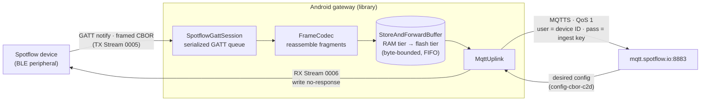
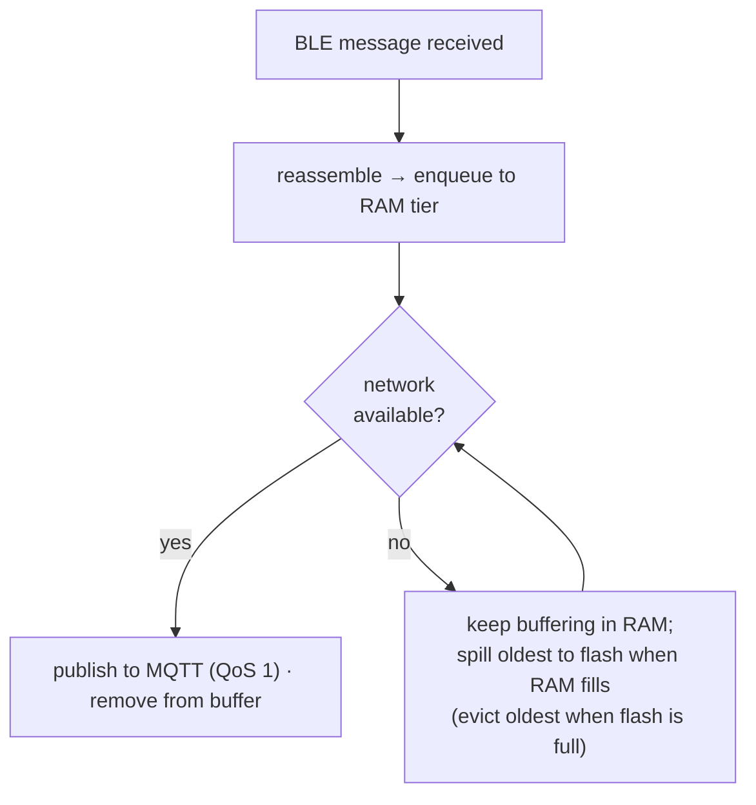

# Spotflow Android BLE Gateway

A reusable Android library (Kotlin, shipped as an AAR) that turns any Android app into a **Spotflow BLE
gateway**: it connects to devices running the [Spotflow Device SDK](https://github.com/spotflow-io/device-sdk)
with the BLE transport enabled and relays their diagnostics (logs, metrics, core dumps, configuration) to
the Spotflow cloud over MQTT — **while the screen is off**, **across reconnects**, and **through network
outages**.

The goal is drop-in integration for hardware vendors who already ship an Android companion app (e.g. a
smart thermostat): add the library, hand it a connection or let it scan, and their BLE devices show up in
Spotflow.

> **Download:** each [GitHub Release](../../releases) (published automatically on every `v*` tag) attaches
> the demo **APK** (sideload to try the gateway) and the library **`.aar`** (drop into an integrating app).

## Modules

| Module | Purpose |
| --- | --- |
| `spotflow-ble-gateway` | The reusable library (`io.spotflow.ble`), published as an AAR. |
| `app` | A reference gateway app that uses the library. |

## How it works



Received BLE messages are reassembled and **buffered RAM-first** (spilling to a flash tier only during
longer outages), then a drainer publishes them to MQTT when the network is available — so data survives
outages, the flash isn't worn in steady state, and BLE ingestion never blocks on the network.

The cloud side of each device (its buffer, MQTT connection and drainer — `CloudLink`) is independent of
the BLE connection: when a device disconnects, its link keeps uploading whatever is still buffered and
then closes; if the device reconnects meanwhile, the new session takes over the still-connected link.
Buffers left on disk by an earlier run are uploaded as soon as the gateway is created, even if those
devices never come back.

### Protocol

- **GATT** service `26530001-81E5-4861-82AE-2C92E6887922`, characteristics: Capabilities (`0002`),
  Device ID (`0003`), Session Metadata (`0004`), TX Stream `NOTIFY` (`0005`), RX Stream `WRITE`-no-response
  (`0006`).
- **Framing** — a message may exceed the negotiated ATT MTU (as low as 23 bytes), so it is split into
  fragments. `FrameCodec` handles fragmentation (outgoing) and reassembly (incoming). Flags: `IS_FIRST`
  (`0x01`), `IS_LAST` (`0x02`).
- **Message types** — `TELEMETRY` (`0x02`), `REPORTED_CONFIGURATION` (`0x03`),
  `DESIRED_CONFIGURATION` (`0x04`). Telemetry payloads carry logs, metrics **and core-dump chunks**; the
  gateway relays them opaquely (CBOR is not parsed).
- **Cloud** — one MQTT-over-TLS connection per device to `mqtt.spotflow.io:8883`, QoS 1, with MQTT
  `username = device ID` and `password = ingest key`. TLS is validated by the Android system trust store
  (Let's Encrypt ISRG Root X1 — no bundled CA). Telemetry and session metadata publish to `ingest-cbor`,
  reported configuration to `config-cbor-d2c`; desired configuration is received from `config-cbor-c2d`
  and written down the RX Stream, in order, and acknowledged to the broker only once written.
- **Delivery** is at-least-once: a publish that timed out or was cut off by a disconnect may arrive twice.
- **Reassembly** only delivers a message whose size matches the length declared in its first fragment;
  a message with a lost fragment is dropped rather than forwarded truncated.

### Package layout (`spotflow-ble-gateway/src/main/java/io/spotflow/ble`)

- `protocol/` — `GattProfile` (UUIDs), `MessageType`, `Message`, `FrameCodec` (pure JVM, unit-tested).
- `transport/` — `BleConnection` (with `ManagedBleConnection` / `AttachedBleConnection`),
  `SpotflowGattSession` (serialized GATT command queue + callback bridge), `SpotflowScanner`.
- `cloud/` — `MqttUplink`, `MqttConfig` / `SpotflowTopics`, `CredentialsProvider` + `StaticIngestKey`,
  `StoreAndForwardBuffer` (the two-tier RAM+flash buffer) backed by `PersistentMessageQueue` (its SQLite
  flash tier), `MqttAuthException` / `MqttConnectException`.
- `SpotflowGateway`, `GatewaySession` (BLE side), `CloudLink` / `CloudLinkRegistry` (per-device cloud
  side that outlives BLE sessions), `DeviceFilter` — orchestration.
- `service/SpotflowGatewayService` — foreground service (`connectedDevice`).

## Quick start

### Managed mode (library owns the connection)

```kotlin
val gateway = SpotflowGateway(
    context,
    StaticIngestKey("<ingest-key>"),
    deviceFilter = { address, deviceId -> deviceId in myProvisionedDevices },
)
gateway.startScanning() // scans for the Spotflow service, connects, relays, reconnects
```

> **Security — set a `deviceFilter`.** Managed mode connects to anything that advertises the Spotflow
> service, and the BLE protocol does not authenticate devices. Without a filter, any nearby peripheral
> could publish data under any device ID in your workspace (using your ingest key) and receive that
> device's desired configuration. The gateway also refuses a second live session for a device ID that is
> already connected, and never relays a device with an empty ID.

### Attach mode (host already owns the connection)

For apps that already hold a `BluetoothGatt` to the same device and don't want a second connection.

```kotlin
val connection = gateway.attach(existingGatt)
```

**Host contract for attach mode:**
1. Forward your `BluetoothGattCallback` events to `connection.gattCallback` (use it directly as your
   `connectGatt` callback, or fan out to it from your own callback).
2. Run your own GATT operations inside `connection.runExclusive { gatt -> ... }` while attached — the
   Android BLE stack allows only one outstanding GATT operation at a time, and this serializes yours with
   the gateway's. The gateway doesn't poll RSSI on an attached connection unless you pass
   `attach(gatt, pollRssi = true)`.
3. The host owns connect/disconnect and reconnection; `close()` only detaches.

### Background operation (screen off)

Run the gateway from the bundled foreground service:

```kotlin
SpotflowGatewayService.gatewayFactory = { ctx -> SpotflowGateway(ctx, StaticIngestKey(key)) }
SpotflowGatewayService.onReady = { it.startScanning() }
SpotflowGatewayService.start(context)
```

It runs as foreground service type `connectedDevice` with a persistent (customizable) notification. For a
dedicated always-on gateway, also guide users to disable battery optimization (Doze) for the app.

The service is `START_STICKY`, so Android recreates it after killing the process — but in a fresh process
the static `gatewayFactory` / `onReady` hooks are unset. **Set them from `Application.onCreate()`**
whenever the gateway should be running (the demo's `GatewayApp` does this from a persisted flag);
otherwise the restarted service stops itself and relaying ends until the app is opened again.

## Resilience



- **Reconnect** — a dropped BLE link is reconnected automatically (a direct connect first, then
  `autoConnect` so Android re-attaches the moment a known device reappears, with exponential backoff). A
  device that stays away for 10 minutes is released (freeing one of Android's limited GATT client slots)
  and picked up again by the scanner when it reappears. The MQTT uplink reconnects on its own too, and the
  drainer keeps the link warm during idle periods so the status stays connected rather than only
  reconnecting when the next message arrives.
- **Store-and-forward buffer** — a two-tier buffer keeps diagnostics flowing through outages without
  wearing the flash. In steady state messages flow through a small **RAM tier only** (no disk writes);
  once the RAM tier fills (`ramBufferMaxBytes`, default 1 MiB — i.e. the network has been down a while) the
  oldest messages **spill to a crash-safe, byte-bounded per-device SQLite tier** that survives the app
  being killed or the phone rebooting. Spills are written in batches (one transaction each), so an
  outage costs occasional flash writes rather than one per message. Total size is bounded by
  `bufferMaxBytes` (default 50 MiB), evict-oldest when full, and everything drains in FIFO order once
  connectivity returns — whether or not the device is still connected. With `bufferMaxBytes` ≤
  `ramBufferMaxBytes` there is no flash tier at all (RAM-only). Trade-off: data still in the RAM tier is
  lost if the process is killed.
- **Bluetooth off/on** — the gateway watches the Bluetooth adapter itself, so turning Bluetooth off and
  back on tears down and re-establishes sessions automatically — even with the screen off, since it runs in
  the foreground service. (Turning Bluetooth off often doesn't deliver a GATT disconnect callback, which
  would otherwise leave a session parked forever.) The demo app additionally prompts to enable Bluetooth
  before starting and shows a tappable banner if it's turned off while running.
- **Cloud errors** — a rejected ingest key surfaces the broker's CONNACK reason (e.g.
  `BAD_USER_NAME_OR_PASSWORD`) as `MqttAuthException` and stops retrying instead of hammering the broker.
  A message the broker keeps rejecting (a "poison" message) is dropped after a few attempts — also when
  the broker reacts by disconnecting — so it can't block the rest of the buffer.

## Configuration

```kotlin
val gateway = SpotflowGateway(
    context,
    credentials = StaticIngestKey(key),   // or implement CredentialsProvider for rotation / per-device keys
    mqttConfig = MqttConfig(
        bufferMaxBytes = 50L * 1024 * 1024,     // total store-and-forward buffer (RAM + flash)
        ramBufferMaxBytes = 1L * 1024 * 1024,   // RAM tier; spills to flash only past this
        // host / port / qos / topics are configurable; defaults target production
    ),
)
```

`SpotflowTopics` (inside `MqttConfig`) lets you override the topic names. `CredentialsProvider` is a
functional interface, so hosts can resolve the ingest key per device or refresh it on demand.

## Permissions

The library declares the BLE, foreground-service and network permissions it needs; hosts merge them
automatically. Runtime notes:

- **Android 12+ (API 31+):** the app requests `BLUETOOTH_SCAN` + `BLUETOOTH_CONNECT` at runtime;
  `POST_NOTIFICATIONS` on Android 13+.
- **Android 11 and older (API ≤ 30):** BLE scanning requires the **Location** permission **and** the
  system Location toggle to be **on** — otherwise scanning silently finds nothing.

## Building

Requires **JDK 17** and the **Android SDK** (`compileSdk 35`, `minSdk 26`). Point Gradle at the SDK via a
`local.properties` with `sdk.dir=/path/to/Android/sdk` (or the `ANDROID_HOME` env var).

```bash
./gradlew :spotflow-ble-gateway:testDebugUnitTest   # run the library unit tests (no device needed)
./gradlew :spotflow-ble-gateway:assembleRelease     # build the AAR
./gradlew :app:assembleDebug                        # build the demo app
```

CI (`.github/workflows/ci.yml`) runs the library unit tests on every push and pull request.

### Signing

The demo's signing key is never committed. Gradle reads it from `SPOTFLOW_KEYSTORE_FILE`,
`SPOTFLOW_KEYSTORE_PASSWORD`, `SPOTFLOW_KEY_ALIAS` and `SPOTFLOW_KEY_PASSWORD`; CI decodes the keystore
from the `SPOTFLOW_KEYSTORE_BASE64` repository secret (plus the three others). With the key, debug and
release builds are signed identically, so every CI-built APK can update the previous one. Without it,
local debug builds use your machine's debug key and release builds are unsigned — and the release
workflow refuses to publish.

## Testing

1. **Unit (no hardware):** `FrameCodecTest` covers fragmentation/reassembly incl. the 23-byte MTU,
   multi-fragment messages, and malformed or incomplete input; `PersistentMessageQueueTest` and
   `StoreAndForwardBufferTest` cover the two-tier buffer (FIFO across tiers, eviction, schema upgrade,
   RAM-only mode); `GatewaySessionTest` covers the orchestration against fake BLE/MQTT (offline buffering,
   uploading after disconnect, link hand-over, device filter, poison messages, desired configuration,
   recovering buffers from an earlier run).
2. **On device:** flash the Device SDK BLE sample onto a supported board (e.g. ESP32-C3/C6, Silicon Labs
   EFR32), install the demo app, enter an ingest key and tap **Start**. Verify diagnostics arrive in the
   Spotflow cloud, then exercise the resilience paths:
   - turn the **screen off** — relaying continues;
   - **restart the device** — the gateway reconnects and resumes;
   - toggle **airplane mode** — the buffer grows offline and drains when back online;
   - force a **core dump** — the full dump is delivered.
